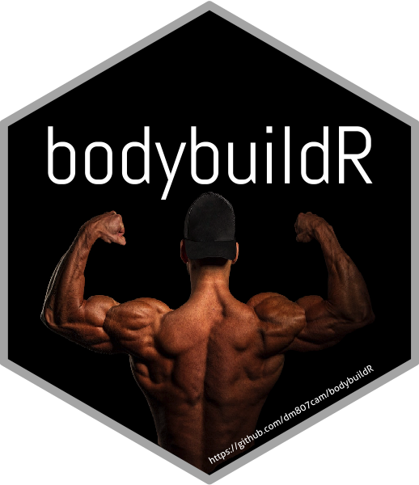

# bodybuildR 
 An R package for fitness enthusiasts to monitor body composition and workouts.

# Install
As of now, bodybuildR is not available through CRAN. 
I recommend to install bodybuildR directly from this github repository using 'devtools'.</br>
```devtools::install_github('dm807cam/bodybuildR')```

To see the full list of available functions:</br>
```library('bodybuildR')```</br>
```ls('package:bodybuildR')```</br>

## TODO
- add a vignette to introduce all functions
- include function to calculate macros
- include regression type model to predict body composition


Bodybuilder photo used in the logo by <a href="https://unsplash.com/@gorillafreak?utm_source=unsplash&utm_medium=referral&utm_content=creditCopyText">Gorilla Freak</a> on <a href="https://unsplash.com/s/photos/bodybuilding?utm_source=unsplash&utm_medium=referral&utm_content=creditCopyText">Unsplash</a>
  
